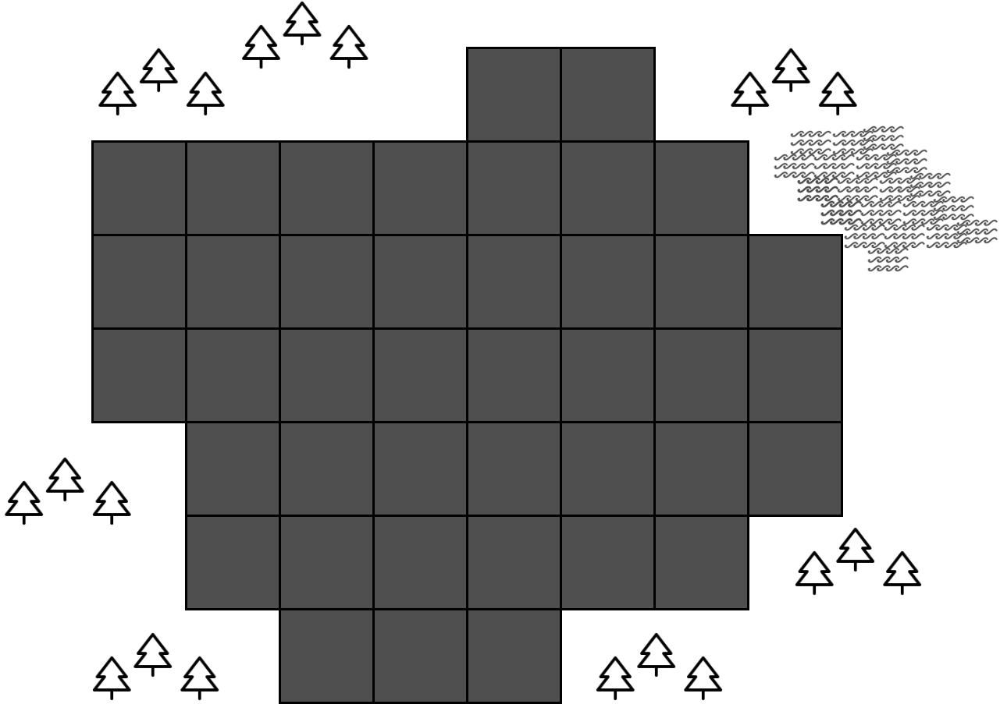

# Treasure Hunt

## Elevator Pitch
- Пазл-игра на поиск по подсказкам. Это как классический сапер, но с инверсией задачи.
- Карточная пошаговая пазл-игра инверсный сапер в сеттинге недалекого бедующего.

## Общая информация
|||
| ---------------------- |:-------------------------------------|
| Жанр                   | Сапер (инверсивный)                  |
| Сеттинг                | Различные биомы в недалёком будущем. |
| Камера                 | Изометрия, 3D                        |
| Модель распространения | Free-to-play                         |
| Платформа              | Mobile, browser                      |

## USP
- Легкий пазл по поиску предмета по подсказкам.
- Подсказки это колода карт, которую игрок собирает. Разные карты представляют собой разные типы подсказок.
- Игрок имеет возможность прокачивать свои карты и составлять колоду под себя.

## Игровой мир и сюжет
Главный герой искатель, который с помощью дрона занимается поисковыми работами в «новом» мире.
Игрок по мере игры получает новые крупицы информации об этом мире и меняет мнение о мире, в котором он оказался. 

## Игровой процесс

Игра разделена на 3 фазы:
- Выбор локации для прохождения.
- Поиск клада на уровне и сбор монет и карт с подсказками.
- Прокачка колоды подсказок.

При запуске игры появляется карта на которой отмечены локации доступные игроку для прохождения.
После прохождения локации, открываются новые локации, таким образом у игрока всегда есть выбор.

Предлагаемые локации отличаются сложностью на которую ориентируется игрок при выборе.
Более сложные локации дают большую награду, но и требуют более сильную колоду подсказок.

После выбора происходит переход с карты на локацию.
Игроку дается определенное количество ходов за которые он должен найти клад.
На локации есть игровое поле состоящее из клеток.
Чем сложнее уровень, тем меньше запас ходов и тем больше клеток на игровом поле.

Игрок открывает клетку, после чего показывается содержимое.
Клетка может содержать в себе клад, подсказку о месторасположении клада, монеты или карты.
После того как игрок найдет клад, игра на локации заканчивается и игрок возвращается на карту.

С помощью монет игрок покупает новые подсказки.
Через объединение одинаковых карт усиливает карту.
